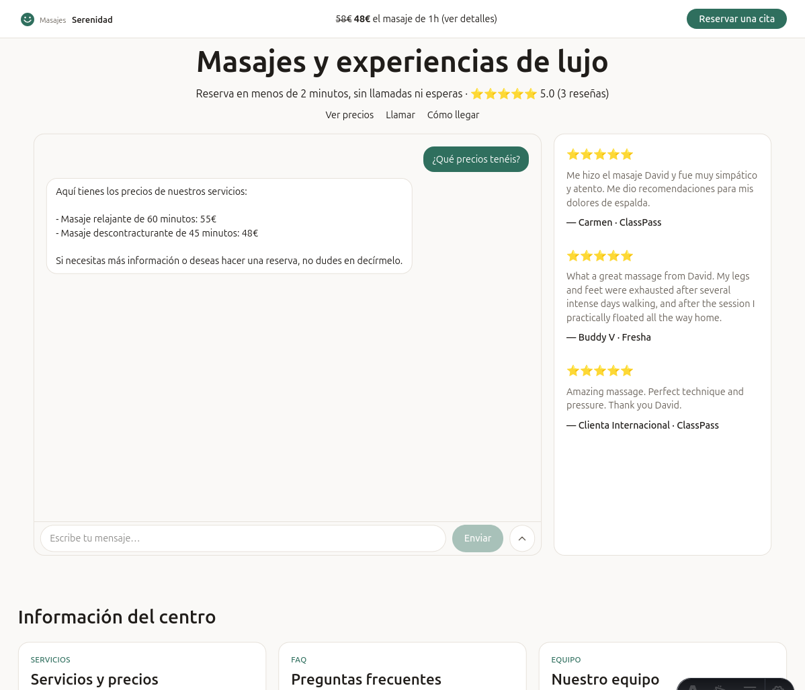

# Qué es este proyecto

Un **orquestador agéntico**: un asistente conversacional que no solo responde
preguntas sobre un negocio, sino que puede *actuar* sobre él — comprobar
disponibilidad, crear una reserva, registrar un pedido — a través de las
mismas herramientas que usaría una persona del equipo, expuesto sobre todo
por canales de chat (web, Telegram) mientras la web pública actúa como
escaparate estático generado desde la misma fuente de conocimiento que
alimenta al asistente.

El caso de ejemplo con el que se construyó y se prueba es un centro de
masajes — reservar una cita, preguntar precios, consultar la política de
cancelación — pero esa elección es deliberadamente arbitraria. La frontera
que organiza todo el diseño es la que separa **lo que cambia por negocio**
(`config/business.yaml`, y el vault de Obsidian con el conocimiento del
negocio) de **lo que no cambia nunca** (el dominio, el orquestador, los
adaptadores): copiar el repo, cambiar ese YAML y esa carpeta de notas, y
tener un asistente para una peluquería o un restaurante sin tocar una línea
de `domain/` ni de `application/`. `doc/006-extender-a-otro-negocio.md`
recorre ese proceso paso a paso con un ejemplo concreto.

El chat, las reseñas y la rejilla de contenido de la captura vienen del
mismo negocio demo con el que se prueba el sistema — nada hardcodeado para
la captura: es exactamente lo que genera `config/business.yaml` +
`vault_example/` tal cual están en este repo.

## Para quién es esto

Para un negocio pequeño que quiere que un cliente pueda reservar, preguntar
precios o consultar horarios por chat sin que una persona tenga que atender
cada mensaje — y para quien construye ese asistente y necesita que añadir
disponibilidad para un segundo negocio, o sustituir Postgres por otra base de
datos, o cambiar de proveedor de LLM, sea un cambio local y no una reescritura.

## Estado actual: Fase I

Lo que hay hoy en este repositorio es un **esqueleto funcional** — no una
maqueta ni un prototipo desechable, sino un sistema que reserva citas de
verdad, consulta un RAG de verdad, y se ha probado de punta a punta con
proveedores de LLM reales (Anthropic, Cohere, OpenAI). `doc/002-fase-1-alcance.md`
es el mapa completo de qué se construyó, con qué tecnología y por qué, y qué
queda abierto todavía.

## Cómo está organizada esta documentación

Esta serie de documentos, pensada como narrativa más profunda que la
referencia operativa del `README.md` (que cubre puesta en marcha, tests,
lint) o el resumen técnico de `CLAUDE.md` (pensado para asistir a quien
edita el código, no para leerse de un tirón):

1. **001-intro.md** (este documento) — qué es el proyecto y para quién.
2. **[002-fase-1-alcance.md](002-fase-1-alcance.md)** — mapa completo de lo
   construido en Fase I, módulo por módulo, con la tecnología elegida para
   cada pieza y por qué.
3. **[003-modelo-datos.md](003-modelo-datos.md)** — dónde vive cada entidad
   hoy (memoria, Postgres, Redis, sistemas externos) y bajo qué condición.
4. **[004-arquitectura.md](004-arquitectura.md)** — recorrido narrativo de la
   arquitectura hexagonal, con el camino completo de una petición de chat.
5. **[005-conocimiento-del-negocio.md](005-conocimiento-del-negocio.md)** —
   cómo funciona el vault de Obsidian y el RAG que lo indexa.
6. **[006-extender-a-otro-negocio.md](006-extender-a-otro-negocio.md)** —
   ejemplo paso a paso de adaptar el sistema a un negocio distinto.
7. **[007-despliegue.md](007-despliegue.md)** — checklist de puesta en
   producción, más allá de `localhost`.
8. **[008-api.md](008-api.md)** — referencia de los endpoints HTTP del chat.
9. **[009-errores-conocidos.md](009-errores-conocidos.md)** — avisos y
   errores que vas a ver corriendo el sistema o la CI que ya están
   diagnosticados y no son bugs.
10. **[010-prompt-engineering.md](010-prompt-engineering.md)** — dónde y
    cuándo se construye el prompt del asistente, qué superficies existen
    para tocar la calidad de sus respuestas, y el método para mejorarlas y
    verificarlas sin regresiones (#21, #22, #31, #32).
11. **[011-integracion-continua.md](011-integracion-continua.md)** — qué
    corre en cada push/PR (`lint`/`mypy`/`test`), por qué cada uno tiene el
    alcance que tiene, el job opcional de calidad de prompts, y cómo
    reproducir CI en local antes de hacer push.
12. **[012-decisiones-tecnologicas.md](012-decisiones-tecnologicas.md)** —
    qué tecnologías se usan y cuáles del stack habitual del mercado (LangChain,
    LangGraph, CrewAI, LlamaIndex, Next.js, Pinecone...) se han evitado
    deliberadamente, y por qué.
13. **[013-plan-pruebas-manual.md](013-plan-pruebas-manual.md)** — plan de
    pruebas manual end-to-end (tono comercial, streaming, panel interno,
    multi-proveedor de LLM) para lo que `pytest` no cubre por sí solo, a
    ejecutar antes de dar por buena una release.

Para poner el sistema en marcha en local, el punto de partida sigue siendo el
[`README.md`](../README.md) de la raíz del repo.
