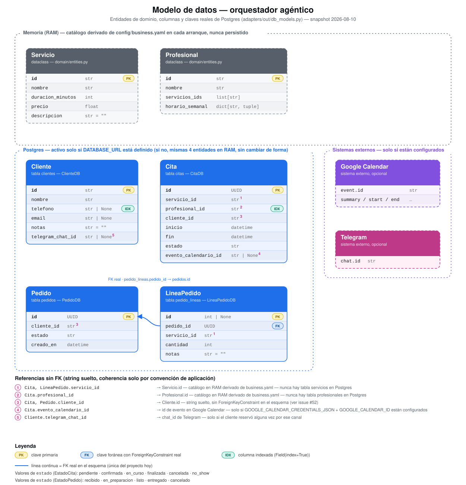

# Modelo de datos: dónde vive cada entidad hoy

> Documento de referencia sobre dónde se guarda cada entidad del sistema y bajo
> qué condición — nace del issue #36 ("Revisar modelo de datos"), movido aquí
> porque en la práctica era un documento, no una tarea con un entregable de
> código. El plan original de ese issue sigue vigente aunque el issue se
> cierre: **reabrir o comentar este documento cada vez que un cambio toque el
> modelo de datos** (nueva entidad, nueva tabla en `db_models.py`, un
> repositorio que pasa de memoria a Postgres, un nuevo store externo) para no
> perder la foto de conjunto según crece el proyecto.

## Por qué existe este documento

El proyecto tiene, a la vez, cuatro sitios distintos donde puede vivir un
dato — memoria del proceso, Postgres, Redis, y un sistema externo (Google
Calendar) — y cuál de los cuatro le toca a cada entidad depende de variables
de entorno opcionales (`DATABASE_URL`, `REDIS_URL`,
`GOOGLE_CALENDAR_CREDENTIALS_JSON`/`GOOGLE_CALENDAR_ID`), no de una decisión
fija en el código. Esa flexibilidad es deliberada — es la misma frontera de
"todo es un adaptador intercambiable" que organiza el resto de la arquitectura
(ver `doc/002-fase-1-alcance.md`) — pero tiene un coste: sin un mapa explícito
es fácil perder de vista, según crece el número de piezas opcionales, qué pasa
realmente en un despliegue con solo algunas activadas.

## Mapa actual (2026-08-09)

| Entidad | Dónde se guarda | Condición |
|---|---|---|
| `Servicio` | Memoria (RAM) | Siempre — se reconstruye desde `config/business.yaml` en cada arranque, nunca se persiste a BBDD |
| `Profesional` | Memoria (RAM) | Siempre — igual que `Servicio`, catálogo derivado del YAML |
| `Cita` | Postgres (tabla `citas`) si `DATABASE_URL`; si no, memoria (RAM) | Opcional |
| `Cliente` | Postgres (tabla `clientes`) si `DATABASE_URL`; si no, memoria | Opcional |
| `NotaCliente` | Postgres (tabla `notas_cliente`) si `DATABASE_URL`; si no, memoria | Opcional |
| `Pedido` + `LineaPedido` | Postgres (tablas `pedidos` + `pedido_lineas`) si `DATABASE_URL`; si no, memoria | Opcional |
| Fragmentos del vault (conocimiento/RAG) | Chroma (base vectorial local, carpeta `./chroma_data` por defecto) | Siempre, independiente de `DATABASE_URL` |
| `SesionConversacion` (historial de chat) | Redis si `REDIS_URL`; si no, memoria (RAM) — puerto `RepositorioSesiones` | Opcional (desde #18) |
| `CodigoVerificacion` (código de un solo uso para comprobar un teléfono) | Redis si `REDIS_URL` (TTL nativo vía `SETEX`); si no, memoria (RAM) — puerto `RepositorioCodigosVerificacion` | Opcional (desde #84) |
| Evento espejo en Google Calendar | Google Calendar (sistema externo, no es BBDD del proyecto) | Opcional, solo si `GOOGLE_CALENDAR_CREDENTIALS_JSON`/`GOOGLE_CALENDAR_ID` están configurados |
| Mensaje de confirmación/cancelación por Telegram | Telegram (sistema externo, no se persiste en absoluto — es un envío, no un dato guardado) | Opcional, solo si `TELEGRAM_BOT_TOKEN` está configurado (desde #38) |
| Mensaje de confirmación/cancelación por WhatsApp | WhatsApp (sistema externo, no se persiste) | Opcional, solo si `WHATSAPP_ACCESS_TOKEN`/`WHATSAPP_PHONE_NUMBER_ID` están configurados (desde #86) |
| Mensaje de confirmación/cancelación o código de verificación por SMS | SMS vía Twilio (sistema externo, no se persiste) | Opcional, solo si `TWILIO_ACCOUNT_SID`/`TWILIO_AUTH_TOKEN`/`TWILIO_NUMERO_REMITENTE` están configurados (desde #85) |

**Bases de datos en juego:**

- **Postgres** (opcional vía `DATABASE_URL`) → citas, clientes, pedidos/líneas
  de pedido.
- **Chroma** (siempre, local) → conocimiento del negocio para el RAG.
- **Redis** (opcional vía `REDIS_URL`) → historial de sesiones de
  conversación, y códigos de verificación de teléfono de corta duración
  (#84).
- **RAM del proceso** → servicios, profesionales (siempre); también
  citas/clientes/pedidos si no hay `DATABASE_URL`, sesiones de conversación
  si no hay `REDIS_URL`, y códigos de verificación si tampoco hay `REDIS_URL`.
- **Google Calendar** (externo, opcional) → solo espejo de citas, no fuente de
  verdad propia.
- **Telegram, WhatsApp y SMS (Twilio)** (externos, opcionales) → no almacenan
  nada del sistema; son los canales de salida de las notificaciones
  best-effort que disparan `CrearReserva`/`CancelarReserva`/
  `CambiarEstadoCita`, y del código de verificación de teléfono (#84) —
  Telegram desde #38, WhatsApp desde #86, SMS desde #85.

Este mapa es una foto respecto a la versión original del issue #36
(2026-08-07): en aquel momento las sesiones de conversación no tenían ni
siquiera un repositorio formal (dos `dict` sueltos en `fastapi_app.py` y
`telegram_bot.py`) y no existía la fila de Telegram como destino de
notificación. Las dos secciones siguientes explican qué cambió y por qué.

## Diagrama entidad-relación (Postgres)

Diagrama generado a partir del estado real de `adapters/out/db_models.py` —
columnas, tipos y claves tal cual están hoy, no una representación
aspiracional. Además de las cuatro tablas Postgres (`clientes`, `citas`,
`pedidos`, `pedido_lineas`), incluye `Servicio`/`Profesional` (solo en
memoria, nunca persistidas) y los dos sistemas externos opcionales que se
referencian desde `Cita`/`Cliente` (Google Calendar, Telegram), para dar la
foto completa de dónde vive cada dato y no solo lo que hay en Postgres.

Dos cosas que vale la pena leer directamente del diagrama:

- La única `ForeignKeyConstraint` real de todo el esquema es
  `pedido_lineas.pedido_id → pedidos.id`. Todas las demás relaciones
  (`cliente_id` en `citas`/`pedidos`, `servicio_id`/`profesional_id` en
  `citas`, `servicio_id` en `pedido_lineas`) son strings sueltos sin
  integridad referencial a nivel de base de datos — ver #52 para el caso
  concreto en que eso produjo una cita "huérfana" (un `cliente_id` sin
  `Cliente` asociado).
- `evento_calendario_id` (en `citas`) y `telegram_chat_id` (en `clientes`)
  son los dos únicos puentes hacia sistemas externos que persiste el propio
  esquema, y ambos son opcionales por diseño (columnas `str | None`,
  poblados solo si el sistema correspondiente está configurado).

SVG estático en `doc/assets/modelo-datos-erd.svg`, generado con un script de
un solo uso (no versionado) a partir de las columnas de `db_models.py` —
regenerar a mano la próxima vez que el esquema cambie; no hay generador
automático corriendo en CI todavía.

## Qué se resolvió desde la última foto

**Sesiones de conversación pasan a tener un puerto propio (#18, cerrado).**
`SesionConversacion` (definida en `application/orchestrator.py`, no en
`domain/`, porque una sesión de chat no es un concepto del dominio del
negocio) tiene ahora su propio puerto, `RepositorioSesiones`
(`application/ports.py`), con dos implementaciones intercambiables:
`RepositorioSesionesMemoria` (el comportamiento de siempre, un dict por
proceso) y `RepositorioSesionesRedis` (`adapters/out/repositorio_sesiones_redis.py`),
que serializa `sesion.historial` como JSON bajo la clave `sesion:{canal}:{usuario_id}`.
`main.py::construir_repositorio_sesiones()` elige entre ambas según
`REDIS_URL`, con el mismo patrón "opcional, y sin ella el sistema se comporta
igual que antes" que ya usan `DATABASE_URL` y las variables de Google
Calendar. Se verificó manualmente que con Redis activo una conversación
sobrevive a un reinicio completo del proceso, y que sin él, no — que era
exactamente el problema que motivó el issue.

**`Cliente` gana un campo de identidad por canal (#38, cerrado).**
`NotificadorMensajes` (el puerto que envía confirmaciones/cancelaciones por
Telegram) ya tenía una implementación real desde #12
(`NotificadorMensajesTelegram`), pero no estaba conectado a nada: ni
`CrearReserva`/`CancelarReserva` la recibían como dependencia, ni `main.py` la
instanciaba. Conectarla exigió resolver primero una pregunta de modelo de
datos que el propio #36 dejaba abierta implícitamente: `enviar()` necesita un
`chat_id` de Telegram, y `Cliente` (`domain/entities.py`) solo guardaba
`telefono` y `email` — no había ningún campo de "identificador de contacto por
canal". La decisión fue añadir `telegram_chat_id: str | None` directamente a
`Cliente` (en vez de resolverlo desde `SesionConversacion` en el momento del
envío) y poblarlo desde `CrearReserva` cuando la reserva se origina en una
sesión de Telegram. La migración `8c8bf2f0d3c8_telegram_chat_id_en_clientes.py`
añade la columna equivalente a `ClienteDB` en Postgres. Con el campo
disponible, `CrearReserva`/`CancelarReserva` reciben un `NotificadorMensajes |
None` opcional y mandan el mensaje tras guardar la cita — best-effort, mismo
patrón que la sincronización con Google Calendar: un fallo de Telegram nunca
impide crear o cancelar una reserva en el sistema propio.

**`Cita` gana una consulta por rango, sin nueva tabla (#40, cerrado).** La
vista de agenda semana/mes del panel interno necesitaba consultar citas de
varios días a la vez, y `RepositorioCitas` solo exponía `citas_en_fecha(dia)`
(un único día). Se añadió `citas_en_rango(desde, hasta)` al puerto, con
implementación en ambos repositorios (`RepositorioCitasMemoria` y
`RepositorioCitasPostgres`), y `citas_en_fecha` pasó a delegar en
`citas_en_rango(dia, dia)` en vez de duplicar el filtro de fecha en las dos
implementaciones. No es un cambio de *dónde* vive `Cita` — sigue siendo la
misma tabla `citas` de siempre — solo de qué formas se puede consultar; se
documenta aquí porque es el tipo de cambio que este documento existe para no
perder de vista.

**`NotificadorMensajes` gana una implementación de WhatsApp, reutilizable como canal proactivo (#86, cerrado).** Hasta este punto la única notificación real era `NotificadorMensajesTelegram` (#38 arriba); WhatsApp solo sabía responder dentro del propio ciclo del webhook (`adapters/in_/whatsapp_webhook.py`), sin ninguna forma de avisar de forma proactiva. Se extrajo esa lógica de envío a `NotificadorMensajesWhatsApp` (`adapters/out/notificador_whatsapp.py`), que implementa el mismo puerto `NotificadorMensajes` y se reutiliza tanto para responder al webhook como para notificar desde el dominio. `CrearReserva`/`CancelarReserva`/`CambiarEstadoCita` ganan un segundo notificador opcional, `notificador_telefono`, usado cuando el cliente no tiene `telegram_chat_id` — con prioridad Telegram sobre teléfono, nunca los dos canales a la vez para el mismo aviso.

**SMS (Twilio) como segunda opción de canal de teléfono (#85, cerrado).** Mismo puerto `NotificadorMensajes`, nueva implementación `NotificadorMensajesSMS` (`adapters/out/notificador_sms.py`) sobre el SDK de Twilio. `notificador_telefono` (ver #86) se resuelve como WhatsApp si hay credenciales, o si no SMS — nunca los dos a la vez. No añade ninguna tabla ni entidad nueva: solo un segundo adaptador de salida best-effort, igual que Telegram/WhatsApp, sin persistencia propia.

**Verificación de teléfono con código de un solo uso, nueva entidad efímera (#84, cerrado).** Hasta este punto `crear_reserva`/`guardar_nota_cliente` (ver `NotaCliente` más abajo) confiaban en el teléfono dictado en el chat sin ninguna prueba de que fuera su dueño. Nueva entidad `CodigoVerificacion` (`telefono`, `codigo`, `expira_en`) con puerto propio `RepositorioCodigosVerificacion`, mismo patrón dual que `SesionConversacion` (#18 arriba): `RepositorioCodigosVerificacionMemoria` o `RepositorioCodigosVerificacionRedis` según `REDIS_URL`, esta última con TTL nativo vía `SETEX` en vez de depender de una limpieza manual. `SesionConversacion` gana `telefonos_verificados: set[str]` para recordar, dentro de la misma conversación, qué teléfonos ya se comprobaron — con excepción por canal: Telegram y WhatsApp (cuando el teléfono coincide con el número real de la sesión) no piden código, el resto sí.

**Decisión explícita de no crear una tabla N:M (#8, cerrado, no aplica).** La
relación entre un `Profesional` y los servicios que ofrece sigue siendo una
lista de IDs dentro de la propia entidad (`servicios_ids: list[str]`), no una
relación N:M en Postgres con tabla intermedia. Esa tabla solo tendría sentido
si el catálogo (servicios/profesionales) dejara de derivarse de
`business.yaml` en cada arranque y pasara a persistirse — y esa decisión,
evaluada explícitamente, se descartó: la ventaja (editar el catálogo en
caliente desde un panel admin sin redeploy) no compensa el coste (replicar en
otro sitio la validación de `config/schema.py`, más repositorios Postgres
nuevos para servicios/profesionales) sin que exista todavía una necesidad
concreta de esa edición en caliente.

## Migraciones aplicadas

Tres migraciones Alembic hasta la fecha, sobre `db_models.py`
(`ClienteDB`, `CitaDB`, `PedidoDB`, `LineaPedidoDB`):

1. `cfcefe4475b9_citas_clientes_pedidos.py` — esquema inicial: las cuatro
   tablas (`clientes`, `citas`, `pedidos`, `pedido_lineas`).
2. `4794f8eeb103_evento_calendario_id_en_citas.py` — añade
   `evento_calendario_id` a `citas`, para poder referenciar el evento espejo
   creado en Google Calendar (#33) y no perder el enlace entre ambos sistemas.
3. `8c8bf2f0d3c8_telegram_chat_id_en_clientes.py` — añade
   `telegram_chat_id` a `clientes` (#38, ver arriba).

Ninguna migración toca `servicios` ni `profesionales` porque esas dos
entidades nunca han tenido tabla propia — son catálogo derivado del YAML, no
estado persistente.

## Postgres de desarrollo provisionado (#41, cerrado)

El código de la persistencia Postgres ya funcionaba y estaba probado antes de
este issue — el hueco era puramente de infraestructura: en esta máquina no
había ningún Postgres corriendo (sin Docker, sin `psql`, sin paquete
`postgresql`), así que sin `DATABASE_URL` cada proceso (`main.py` y el panel)
tenía su propio `RepositorioCitasMemoria`/`RepositorioClientesMemoria`/
`RepositorioPedidosMemoria` en RAM, aislado del otro. Se resolvió
provisionando un Postgres gestionado gratuito en [Neon](https://neon.tech/)
(sin Docker ni permisos de sistema — mismo patrón que la clave de trial de
Cohere), aplicando `alembic upgrade head` contra él, y documentando
`DATABASE_URL` en `.env.example` (antes era la única variable de conexión sin
comentario explicativo). Se verificó explícitamente el síntoma original con
dos procesos Python independientes construyendo cada uno sus propios repos
contra el mismo `DATABASE_URL` (una réplica mínima de lo que hacen
`main.py::construir_sistema()` y `panel_empleados/streamlit_app.py::_construir_repos()`):
una cita creada por el primero es visible por el segundo sin reiniciar nada.
Postgres de producción queda fuera de este issue — es parte del checklist de
#37.

## Qué sigue sin resolver

Este documento cierra el issue #36 tal como estaba planteado (una foto del
estado actual), pero dos preguntas de fondo que el propio issue original
dejaba abiertas siguen sin decidirse, y no forman parte de este cierre:

- Si el modelo actual — una única entidad `Servicio` sin variantes — aguanta
  un negocio real más allá del ejemplo del centro de masajes. No hay issue
  abierto específico para esto hoy; si aparece, debería enlazar aquí.
  (El otro punto de esta lista, `Cliente` sin historial estructurado más allá
  de `notas: str`, ya se resolvió: #77 sustituye ese campo por `NotaCliente`,
  una entidad propia con `id`/`cliente_id`/`texto`/`creado_en`, múltiples por
  cliente. La migración `notas_cliente` convierte cada `notas` no vacío
  existente en una `NotaCliente` marcada `[Importada]` antes de dropear la
  columna.)
- Las sesiones de conversación en memoria (sin `REDIS_URL`) siguen sin
  compartirse entre procesos ni sobrevivir a un reinicio — comportamiento
  esperado y documentado, no un bug, pero relevante para cualquier despliegue
  con más de un worker que no tenga Redis delante.

Como se indica al principio: la práctica correcta no es mantener este
documento "completo para siempre", sino volver a él cada vez que el modelo de
datos cambie.
